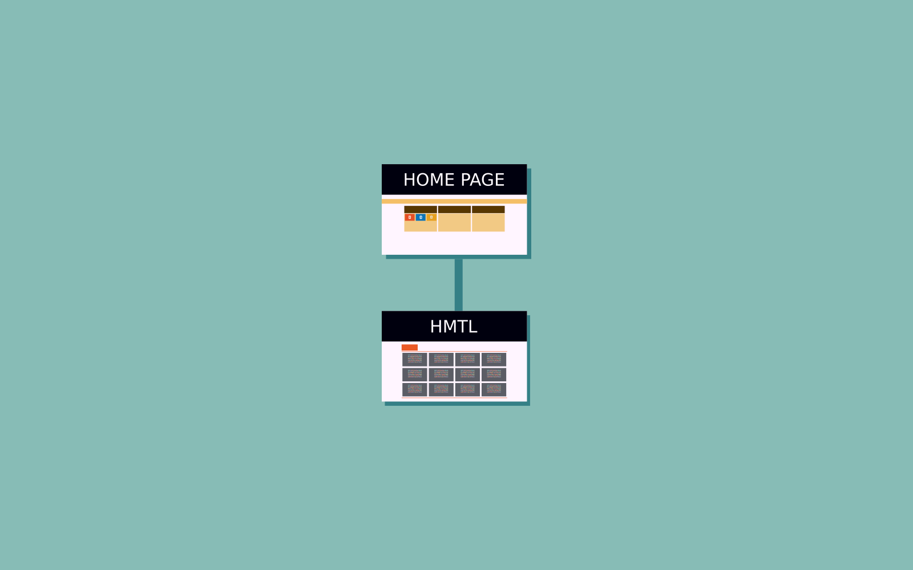
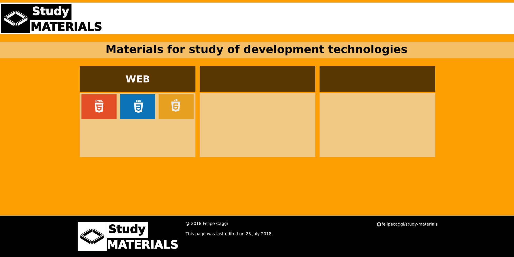
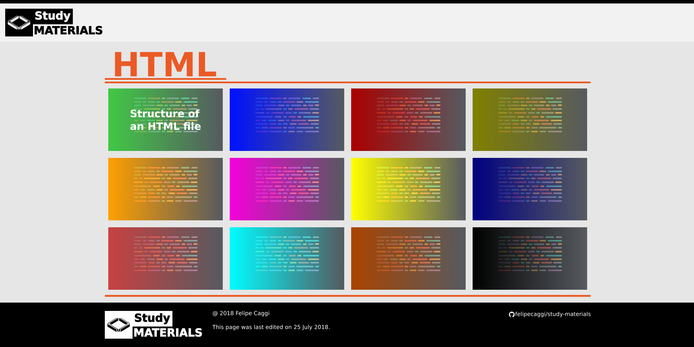
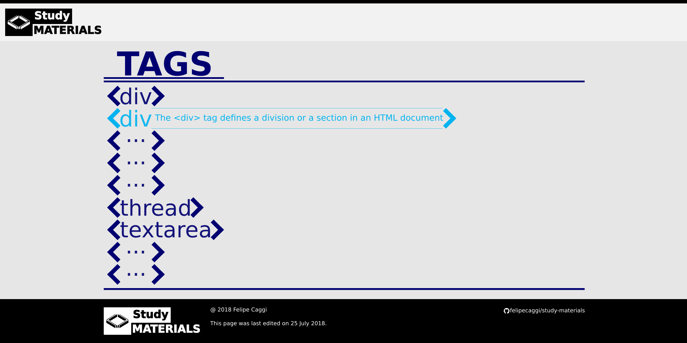

# study-materials

This repository is intended for a web application that contains information about the materials used for the study of development technologies.

## STATUS REPORT (SR)

    15/07/2018 - Initial project description;
                 Initial project status defined in "Planning".

    16/07/2018 - Project status changed to "In progress".

    17/07/2018 - Changing the layout of status defaults;
                 Project status changed to "Idea".

    18/07/2018 - Project status changed to "Initialized".

    19/07/2018 - Defined 1st sketch of the main page.

    20/07/2018 - Sections implemented in the index.html file code based on the first sketch.

    21/07/2018 - Initial CSS code implemented.

    22/07/2018 - Mouse overlay CSS ruleset implemented in 'a' and 'li' elements.

    23/07/2018 - Adds the docs folder with CSS, HTML and JavaScript subfolders.

    24/07/2018 - Working on website design.

    25/07/2018 - Main page template finalized.

    26/07/2018 - Implemented new template of the header section;
                 Implemented new template of the main section.

    27/07/2018 - Implemented new template of the footer section;
                 Code optimization of main.css file.

    28/07/2018 - Working on folder ui-design.

    29/07/2018 - Design workspace transferred to the ui-design folder;
                 Working on website design.

    30/07/2018 - Working on folder ui-design.

    31/07/2018 - Branch for development HTML page.

    01/08/2018 - Implemented CSS of page html.

    02/08/2018 - Working on folder ui-design;
                 Updated HTML and CSS code of main page and html.

    03/08/2018 - Working on folder ui-design.

    05/08/2018 - Working on folder ui-design.

    11/08/2018 - Working on folder ui-design.

    12/08/2018 - Working on folder ui-design;
               - Initialized development of html-tags page.

    13/08/2019 - Working on folder ui-design.

## SITEMAP

### HOMEPAGE

### HTML PAGE

### HTML-TAGS PAGE

## Acronyms

    SR - Status Report